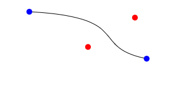
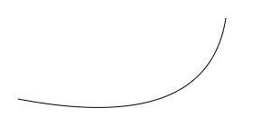

# HTML \<Canvas\>

מקור: [https://developer.mozilla.org/en-US/docs/Web/API/Canvas_API/Tutorial/Drawing_shapes](https://developer.mozilla.org/en-US/docs/Web/API/Canvas_API/Tutorial/Drawing_shapes)

## הרשת (Grid)

כשמגדירים את הקנבס מגדירים לו את גודל הרשת שלו. באמצעות  `<canvas height="450" width="900">`

ברירת המחדל היא גובה 150 ורוחב 300

## מלבנים

הקנבס תומך בשני צורות בסיסיות לציור, מלבנים וציור נתיב חופשי (קו אחרי קו).
שלוש פונקציות לציור מלבן:

* `fillRect(x, y, width, height)`  - לציור מלבן מלא, שכולו צבוע בצבע שהוגדר.
* `strokeRect(x, y, width, height)` – לציור רק קו מתאר של מלבן (רק את ההקף)
* `clearRect(x, y, width, height)` – למחוק את כל התוכן במלבן שהוגדר (לצייר מלבן "לבן")
  ערכי הנקודה מציינים את מיקום הנקודה השמאלית עליונה של המלבן.

## נתיב (path)

בתחילה מגדירים את המבנה שאותו רוצים לצייר, לאחר מכן משתמשים בפקודות הציור כדי לצייר אותו. בסוף ניתן להגדיר לו מילוי.
בגלל שמדובר בתהליך הגדרה, יש לפתוח קודם ב: `beginPath()`  ולסיים ב `closePath()` כשביניהם פקודות הנתיב.

* `stroke()` מצייר את קו המתאר (הקף)
* `fill()`  - מצייר את הצורה צבועה מלא (שטח)

השימוש ב `closePath()` הוא לא חובה, כשמשתמשים בפונקציה הזו, הצייר מנסה לסגור את הצורה על ידי קו שמחבר בין הנקודה האחרונה לנקודה הראשונה. אם הצורה כבר נסגרה או שיש רק נקודה אחת בנתיב אז היא לא עושה כלום.
קריאה ל`fill()` כאשר הצורה לא סגורה תבצע את אותו ניסיון, לכן אין צורך ב`closePath()` לפני שקוראים ל  `fill()`.
זה לא אותו מצב כאשר קוראים ל`stroke()`

### הזזת העט

כשמציירים נתיב כל תזוזה של העט מצויירת. אם רוצים לבצע "קפיצה" למיקום אחר מבלי לצייר יש להשתמש ב ;`moveTo(x, y)` משנה את מיקום העט בזמן ציור נתיב מבלי לצייר קו.

### פעולות שניתן לעשות במהלך ציור נתיב

https://developer.mozilla.org/en-US/docs/Web/API/CanvasRenderingContext2D#paths

* `eginPath()` - לעיל
* `closePath()`
* `moveTo()`
* `lineTo(x,y)` - מחבר את הנקודה האחרונה שהוגדרה לנקודה שהוכנסה בקו ישר
* `bezierCurveTo()`
   מוסיף  קו מעוקל כפול [דוגמה](examples/bezierCurveTo().html)

   *קו מעוקל כפול bezierCurve*
* `quadraticCurveTo()`
  מוסיף קו מעוקל 
  [דוגמה](examples/quadraticCurveTo().html) 

   *קו מעוקל* 
* `arc()`
  Adds a circular arc to the current path.
* `arcTo()`
  Adds an arc to the current path with the given control points and radius, connected to the previous point by a straight line.
* `ellipse()`
  Adds an elliptical arc to the current path.
* `rect()`
  Creates a path for a rectangle at position (x, y) with a size that is determined by width and height.
